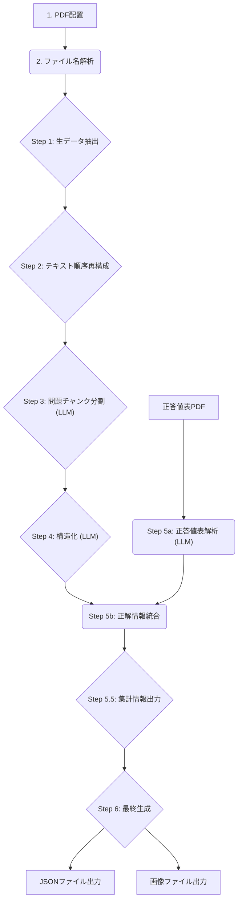

# **medexam-parser: 医師国家試験PDFデータ化プロジェクト**

## **はじめに**

このプロジェクトは、厚生労働省が公開している医師国家試験の問題PDFを解析し、機械可読性の高いJSON形式のデータセットと、問題に付随する画像を抽出することを目的としています。生成されたデータは、学習アプリ、統計分析、研究など、様々な用途での活用が期待されます。

## **ライセンス**

このリポジトリに含まれるソースコードは [GNU General Public License v3.0](https://www.gnu.org/licenses/gpl-3.0.html) のもとで公開されています。

【重要】ライセンスの適用範囲について  
本ライセンスは、このリポジトリに含まれるソースコードおよび関連するドキュメントのみに適用されます。  
利用者がinput/ディレクトリに配置する元のPDFファイル、および本ツールによって生成される\*\*JSONデータや画像ファイル（output/ディレクトリ内の成果物）\*\*は、GPL v3.0の適用範囲外です。これらの著作権は元の権利者に帰属します。成果物の利用にあたっては、元のPDFの利用規約や著作権法を遵守してください。

## **想定される技術スタック**

* **プログラミング言語:** Python 3.9+  
* **実行環境:** Docker, Docker Compose  
* **主要ライブラリ:**  
  * PyMuPDF (fitz): PDFからのテキスト、画像、座標情報の抽出  
  * Pillow: 画像処理、WebP形式への変換  
  * python-dotenv: 環境変数の管理  
  * LLM API Client (e.g., openai, google-generativeai): LLMとの連携  
* **データフォーマット:** JSON, WebP

## **概要**

medexam-parserは、指定された年度の医師国家試験問題PDF（問題冊子、別冊、正答値表）をインプットとして受け取ります。PythonスクリプトがこれらのPDFを解析し、問題文、選択肢、画像、正解といった情報を構造化されたデータに変換します。

**主な特徴:**

* **Dockerによる環境構築:** 実行環境の違いによる問題をなくし、誰でも簡単に実行できます。
* **構造化データ出力:** 全ての問題は、後続処理で扱いやすい統一されたJSON形式で出力されます。
* **画像抽出と最適化:** 問題に関連する画像は自動で抽出され、Webで扱いやすいWebP形式に変換・保存されます。
* **LLMベース解析:** PDFのレイアウト解析や構造化には、主にLLM（大規模言語モデル）を利用します。これにより、複雑なレイアウトにも柔軟に対応します。
* **ステップごとの中間ファイル:** 開発やデバッグを容易にするため、処理の各段階で中間ファイルを出力します。

## **プロジェクトファイル構成**

.  
├── docker-compose.yml     \# Dockerコンテナの起動設定  
├── Dockerfile             \# Dockerコンテナの設計図  
├── requirements.txt       \# Pythonの依存ライブラリ  
├── .env.example           \# 環境変数設定のテンプレート  
├── src/  
│   └── main.py            \# メインの処理スクリプト  
│  
├── input/                 \# ここに処理対象のPDFを配置する  
│   ├── 118a.pdf  
│   ├── 118d.pdf  
│   └── ...  
│  
├── output/                \# 処理結果がここに生成される  
│   ├── json/  
│   │   └── 118.json  
│   └── images/  
│       ├── 118-A-1-1.webp  
│       └── ...  
│  
└── intermediate/          \# 各処理ステップの中間ファイルがここに保存される  
    └── 118a/  
        ├── step1\_raw\_extraction.json  
        ├── step2\_reordered\_text.txt  
        └── ...

## **処理フロー**

データ生成は以下のフローで行われます。問題の分割（Step 3）、構造化（Step 4）、正答値表の解析（Step 5a）はLLMを活用して実行されます。



## **実装ステップと現状**

* [x] **Step 1: Raw Extraction (生データ抽出)**: PDFからテキストと画像の座標情報を抽出する。正答値表PDFに対しては、LLMでの解析に適したプレーンテキスト形式で抽出する。
* [x] **Step 2: Text Reordering (テキスト順序再構成)**: 2段組レイアウトを解析し、テキストを正しい順序に並べ替える。
* [x] **Step 3: Problem Chunking (問題チャンク分割)**: テキストを問題ごとに分割する。LLM（大規模言語モデル）を利用して、問題番号を基にテキストをチャンク化する。長いテキストに対応するため、チャンク分割と結果の統合ロジックを実装。
* [x] **Step 4: Structure Parsing (構造化)**: LLMを利用し、各問題チャンクを問題文、選択肢などを持つ構造化JSONに変換する。バッチ処理に対応し、効率的な処理を実現。
* [x] **Step 5a: Answer Key Parsing (正答値表解析)**: 正答値表PDFから抽出された生データ（Step 1の出力）をLLMで解析し、問題番号と正解のペアを抽出する。
* \[ \] **Step 5b: Answer Integration (正解情報統合)**: Step 4で構造化された問題データと、Step 5aで解析された正解データを結合する。
* \[ \] **Step 5.5: Summary Output (集計情報出力)**: 各PDFファイルごとの問題数、問題タイプの内訳、画像数などの統計情報を中間ファイルとして出力し、検証を容易にする。
* \[ \] **Step 6: Finalization (最終生成)**: 全てのデータを統合し、最終的なJSONと画像ファイルを出力する。


## **実行手順**

#### **1. リポジトリのクローン**

```bash
git clone https://github.com/your-username/medexam-parser.git
cd medexam-parser
```

#### **2. 環境変数の設定**

LLMを利用するためにAPIキーを設定します。`.env.example`をコピーして`.env`ファイルを作成してください。

```bash
cp .env.example .env
```

その後、`.env`ファイルを開き、お使いのLLMのAPIキーを記述します。

```env
# 例: Google Gemini API Key
GOOGLE_API_KEY="your_api_key_here"
```

#### **3. 入力PDFの配置**

処理したい年度の医師国家試験PDF一式を`input/`ディレクトリに配置します。

*   **命名規則の重要性:** スクリプトはファイル名に基づいて処理内容を自動で判断します。
    *   **問題文PDF:** `..._01.pdf` で終わるファイル (例: `tp240424-01a_01.pdf`)
    *   **画像PDF:** `..._02.pdf` で終わるファイル (例: `tp240424-01a_02.pdf`)
    *   **正答値表PDF:** `...seitou.pdf` を含むファイル (例: `tp240424-01seitou.pdf`)
*   **処理の自動スキップ:**
    *   画像PDF (`_02.pdf`) は、テキスト処理が不要なためStep 2, 3, 4が自動的にスキップされます。
    *   正答値表は、Step 5で正解情報を統合するために使用されます。

#### **4. Dockerコンテナのビルド**

最初に、Dockerイメージをビルドします。ソースコードを修正した場合は、このコマンドを再実行して変更を反映させてください。

```bash
docker-compose build
```

#### **5. 解析の実行**

`docker-compose run` コマンドを使用して、解析処理を実行します。


**主要なコマンドライン引数:**

| 引数 | 説明 | デフォルト値 |
| :--- | :--- | :--- |
| `--steps [数値...]` | 実行するステップ番号をスペース区切りで指定します。`5a`, `5b` のようにアルファベットを含むステップも指定可能です。 | 全ステップ |
| `--files [ファイル名...]` | 処理対象のPDFファイルをスペース区切りで指定します。 | `input`内の全PDF |
| `--model-name [モデル名]` | Step 3, 4, 5aで使用するLLMモデル名を指定します。 | `gemini-2.5-flash-lite` |
| `--rate-limit-wait [秒数]`| LLM APIの呼び出し間隔（秒）を指定します。 | `10.0` |
| `--batch-size [数値]` | Step 4で一度に処理する問題数を指定します。 | `5` |
| `--max-batches [数値]` | Step 4で処理する最大バッチ数を指定します（デバッグ用）。`0`の場合は全バッチを処理します。 | `0` |
| `--retry-step3 [回数]` | Step 3 (問題チャンク分割) のLLM API呼び出しが失敗した際のリトライ回数を指定します。 | `3` |
| `--retry-step4 [回数]` | Step 4 (構造化) のLLM API呼び出しが失敗した際のリトライ回数を指定します。 | `3` |
| `--retry-step5a [回数]`| Step 5a (正答値表解析) のLLM API呼び出しが失敗した際のリトライ回数を指定します。 | `3` |

gemini-2.5-flash-liteであれば、rate-limit-waitを60に設定することで1日1440回ぐらいになるので無料枠内に収まるはずです。

**実行例:**

```bash
# 【推奨】まず最初の1バッチだけを処理して、Step4の動作を確認する
docker-compose run --rm parser python src/main.py --steps 4 --files tp240424-01a_01.pdf --max-batches 1

# Step3で3回、Step4で5回リトライするように設定して実行
docker-compose run --rm parser python src/main.py \
    --steps 3 4 --files tp240424-01a_01.pdf \
    --retry-step3 3 --retry-step4 5

# 正答値表のLLM解析 (Step 5a) を実行する
docker-compose run --rm parser python src/main.py --steps 5a --files tp240424-01seitou.pdf

# 全ステップを特定のファイルに対して実行
docker-compose run --rm parser python src/main.py --files tp240424-01a_01.pdf

# モデル名とバッチサイズを変更してStep4を実行
docker-compose run --rm parser python src/main.py --steps 4 --model-name gemini-2.5-pro --batch-size 3

# 引数を指定せずに全ステップを全ファイルに対して実行
docker-compose run --rm parser python src/main.py
```


処理が完了すると、`intermediate/` ディレクトリに各ステップの中間成果物が、`output/` ディリクトリに最終成果物が生成されます。

## **生成される産物の例**

#### **JSONデータ (output/json/{exam_id}.json)**

**禁忌肢を含む選択式問題の例:**

{
  "id": "118-X-99",
  "question_type": "multiple_choice",
  "text": "（問題文）",
  "images": [],
  "choices": [
    { "id": "1", "text": "選択肢1" },
    { "id": "2", "text": "選択肢2" },
    { "id": "3", "text": "選択肢3" },
    { "id": "4", "text": "選択肢4" }
  ],
  "answer": {
    "choices": ["1", "4"],
    "forbidden_choices": ["2"]
  }
}

**Note:** 禁忌肢の情報は、公式に公開されている正答値表には通常含まれていません。この情報を付与するには、別途定義された禁忌肢リストなどを読み込ませる必要があります。

**数字入力問題の例:**

{
  "id": "118-D-75",
  "question_type": "numeric_float",
  "text": "生後1時間の男児...1時間あたりの10%ブドウ糖液投与量を求めよ。...",
  "images": [],
  "choices": null,
  "answer": {
    "value": 9.6,
    "unit": "mL/時間"
  }
}

#### **画像データ (output/images/)**

* 118-D-16-1.webp (第118回 D問題16番の1枚目の画像)

## **今後の課題・展望**

* **対応年度の拡大:** 過去の年度の試験問題PDFにも対応できるよう、パーサーの堅牢性を向上させる。
* **Web UIの開発:** PDFをアップロードし、ブラウザ上で結果を確認・編集できるインターフェースを構築する。
* **精度評価:** LLMによる解析結果の精度を定量的に評価する仕組みを導入する。
* **パフォーマンス最適化:** 大量のPDFを高速に処理するための並列処理やキャッシュ機構を検討する。

## **貢献の方法 (Contributing)**

バグ報告、機能追加の提案、プルリクエストはGitHubのIssuesからお願いします。
