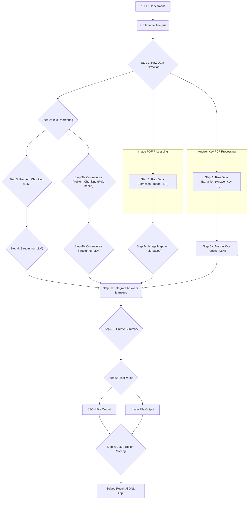

# **medexam-parser: 医師国家試験PDFデータ化プロジェクト / National Medical Examination PDF Data Conversion Project**

## **はじめに / Introduction**

このプロジェクトは、厚生労働省が公開している医師国家試験の問題PDFを解析し、機械可読性の高いJSON形式のデータセットと、問題に付随する画像を抽出することを目的としています。生成されたデータは、学習アプリ、統計分析、研究など、様々な用途での活用が期待されます。

This project aims to parse the National Medical Examination question PDFs released by the Ministry of Health, Labour and Welfare, and extract them into a machine-readable JSON dataset along with associated images. The generated data is expected to be utilized for various purposes such as learning applications, statistical analysis, and research.

## **ライセンス / License**

このリポジトリに含まれるソースコードは [GNU General Public License v3.0](https://www.gnu.org/licenses/gpl-3.0.html) のもとで公開されています。

The source code in this repository is licensed under the [GNU General Public License v3.0](https://www.gnu.org/licenses/gpl-3.0.html).

【重要】ライセンスの適用範囲について / [Important] Scope of License
本ライセンスは、このリポジトリに含まれるソースコードおよび関連するドキュメントのみに適用されます。
利用者がinput/ディレクトリに配置する元のPDFファイル、および本ツールによって生成される**JSONデータや画像ファイル（output/ディレクトリ内の成果物）**は、GPL v3.0の適用範囲外です。これらの著作権は元の権利者に帰属します。成果物の利用にあたっては、元のPDFの利用規約や著作権法を遵守してください。

This license applies only to the source code and related documents contained in this repository.
The original PDF files placed by the user in the `input/` directory, as well as the **JSON data and image files (artifacts in the `output/` directory)** generated by this tool, are outside the scope of GPL v3.0. The copyrights for these belong to the original rights holders. Please comply with the terms of use of the original PDFs and copyright law when using the artifacts.

## **想定される技術スタック / Tech Stack**

*   **プログラミング言語 / Programming Language:** Python 3.9+
*   **実行環境 / Execution Environment:** Docker, Docker Compose
*   **主要ライブラリ / Key Libraries:**
    *   PyMuPDF (fitz): PDFからのテキスト、画像、座標情報の抽出 / For extracting text, images, and coordinate information from PDFs.
    *   Pillow: 画像処理、WebP形式への変換 / For image processing and conversion to WebP format.
    *   python-dotenv: 環境変数の管理 / For managing environment variables.
    *   LLM API Client (e.g., google-generativeai): LLMとの連携 / For integration with LLMs.
*   **データフォーマット / Data Formats:** JSON, WebP

## **概要 / Overview**

medexam-parserは、指定された年度の医師国家試験問題PDF（問題冊子、別冊、正答値表）をインプットとして受け取ります。PythonスクリプトがこれらのPDFを解析し、問題文、選択肢、画像、正解といった情報を構造化されたデータに変換します。

medexam-parser takes the National Medical Examination question PDFs for a specified year (question booklet, separate volume, answer key table) as input. A Python script then parses these PDFs and converts information such as question texts, choices, images, and correct answers into structured data.

**主な特徴 / Key Features:**

*   **Dockerによる環境構築 / Docker-based Environment:** 実行環境の違いによる問題をなくし、誰でも簡単に実行できます。/ Eliminates issues caused by different execution environments, allowing anyone to run it easily.
*   **構造化データ出力 / Structured Data Output:** 全ての問題は、後続処理で扱いやすい統一されたJSON形式で出力されます。/ All questions are output in a unified JSON format that is easy to handle in subsequent processing.
*   **画像抽出と最適化 / Image Extraction and Optimization:** 問題に関連する画像は自動で抽出され、Webで扱いやすいWebP形式に変換・保存されます。/ Images related to questions are automatically extracted, converted to the web-friendly WebP format, and saved.
*   **ルールベースとLLMの併用 / Hybrid Use of Rule-based and LLM:** 画像と問題の紐付けはルールベースで高速・高精度に処理し、複雑なレイアウトの解釈や構造化にはLLM（大規模言語モデル）を利用します。/ The mapping of images to questions is handled with a fast and accurate rule-based approach, while LLMs are used for interpreting and structuring complex layouts.
*   **ステップごとの中間ファイル / Intermediate Files per Step:** 開発やデバッグを容易にするため、処理の各段階で中間ファイルを出力します。/ Intermediate files are output at each stage of the process to facilitate development and debugging.

## **プロジェクトファイル構成 / Project File Structure**

```
.
├── docker-compose.yml     # Dockerコンテナの起動設定 / Docker container startup settings
├── Dockerfile             # Dockerコンテナの設計図 / Docker container blueprint
├── requirements.txt       # Pythonの依存ライブラリ / Python dependency libraries
├── .env.example           # 環境変数設定のテンプレート / Environment variable settings template
├── src/
│   └── main.py            # メインの処理スクリプト / Main processing script
│   └── steps/             # 各処理ステップのスクリプト / Scripts for each processing step
│
├── input/                 # ここに処理対象のPDFを配置する / Place target PDFs here
│   ├── tp240424-01a_01.pdf
│   └── ...
│
├── output/                # 処理結果がここに生成される / Processing results are generated here
│   ├── json/
│   │   └── tp240424-01.json
│   └── images/
│       ├── tp240424-01-A-15-A.webp
│       └── ...
│
└── intermediate/          # 各処理ステップの中間ファイルがここに保存される / Intermediate files for each step are saved here
    └── tp240424-01a_01/
        ├── step1_raw_extraction.json
        └── ...
```

## **処理フロー / Processing Flow**

データ生成は以下のフローで行われます。Step 3b, 4cはルールベースで実行され、問題の分割（Step 3）、構造化（Step 4）、正答値表の解析（Step 5a）はLLMを活用します。

Data generation follows the flow below. Steps 3b and 4c are executed based on rules, while problem splitting (Step 3), structuring (Step 4), and answer key parsing (Step 5a) utilize an LLM.



## **実装ステップと現状 / Implementation Steps and Status**

*   [x] **Step 1: Raw Extraction (生データ抽出)**: PDFからテキスト、画像、およびそれらの座標情報を抽出し、中間ファイルとして保存する。画像はWebP形式でロスレス圧縮して保存される。**画像ブロックには、ページ内で最も近いテキストブロックの内容 (`associated_text`) を関連付けて保存する。** / Extracts text, images, and their coordinate information from PDFs and saves them as intermediate files. Images are saved in lossless WebP format. **Associates the content of the nearest text block (`associated_text`) with each image block.**
*   [x] **Step 2: Text Reordering (テキスト順序再構成)**: 2段組レイアウトを解析し、テキストを正しい順序に並べ替える。/ Analyzes two-column layouts and reorders the text into the correct sequence.
*   [x] **Step 3: Problem Chunking (問題チャンク分割)**: LLMを利用して、テキストを**一問一答形式の問題**ごとに分割する。/ Uses an LLM to split the text into individual **single-answer question** chunks.
*   [ ] **(新規/New) Step 3b: Consecutive Problem Chunking (連続問題チャンク分割)**: **ルールベース**で、症例提示の後に複数の問題が続く「連続問題」のブロックを抽出する。/ **Rule-based** extraction of "consecutive question" blocks, where multiple questions follow a single case presentation.
*   [x] **Step 4: Structure Parsing (構造化)**: LLMを利用し、各問題チャンクを問題文、選択肢などを持つ構造化JSONに変換する。/ Uses an LLM to convert each problem chunk into a structured JSON with fields for the question text, choices, etc.
*   [ ] **(計画/Planned) Step 4b: Consecutive Structure Parsing (連続問題の構造化)**: LLMを利用し、Step 3bで抽出した連続問題のチャンクを、症例提示文と各設問の構造化JSONに変換する。/ Uses an LLM to convert the consecutive question chunks from Step 3b into a structured JSON containing the case presentation and individual sub-questions.
*   [x] **Step 4c: Image Mapping (画像マッピング)**: 別冊画像PDFから抽出された`associated_text`を利用し、**ルールベースで**問題（`join_key`）と画像ファイル名の対応関係をマッピングする。/ Uses `associated_text` extracted from the separate image PDF to map question (`join_key`) to image filenames **based on rules**.
*   [x] **Step 5a: Answer Key Parsing (正答値表解析)**: LLMを利用し、正答値表PDFから問題番号と正解のペアを抽出する。/ Uses an LLM to extract pairs of question numbers and correct answers from the answer key PDF.
*   [ ] **(要修正/Needs Modification) Step 5b: Integration (正解・画像情報統合)**: Step 4, 4b, 4c, **4d**, 5a の結果を統合する。一問一答問題と連続問題の両方に対応し、問題に正解と画像情報を付与する。**連続問題に含まれる問題が一問一答として重複して抽出された場合、これを自動で検知・除外する機能を実装済み。**/ Integrates the results from Steps 4, 4b, 4c, **4d**, and 5a. Will handle both single and consecutive questions, adding correct answers and image information (ID and path). **Includes functionality to detect and exclude single-answer questions that are duplicates of those already in a consecutive block.**
*   [x] **Step 5.5: Summary Output (集計情報出力)**: 各PDFファイルごとの問題数、総画像数、問題タイプの内訳などの統計情報を中間ファイルとして出力する。/ Outputs statistical information such as the number of questions, total images, and a breakdown of question types for each PDF file as an intermediate file.
*   [x] **(修正済み/Modified) Step 6: Finalization (最終生成)**: 全てのデータを統合し、最終的なJSONと画像ファイルを出力する。**一問一答と連続問題を区別できる新しいデータ形式**に対応済み。/ Consolidates all data to output the final JSON and image files. **Already supports the new data format** that distinguishes between single and consecutive questions.
*   [x] **Step 7: Problem Solving (LLMによる問題解答)**: (任意実行 / Optional) Step 6で生成されたJSONと画像をLLMに提示し、問題を解かせる。解答、根拠、自信度、関連領域をJSONL形式で出力する。/ Presents the JSON and images generated in Step 6 to an LLM to have it solve the problems. Outputs the answer, reasoning, confidence level, and related domains in JSONL format.

## **実行手順 / Execution Procedure**

#### **1. リポジトリのクローン / Clone the Repository**

```bash
git clone https://github.com/your-username/medexam-parser.git
cd medexam-parser
```

#### **2. 環境変数の設定 / Set Up Environment Variables**

LLMを利用するステップ（3, 4, 5a）のためにAPIキーを設定します。`.env.example`をコピーして`.env`ファイルを作成してください。
Set the API key for the steps that use the LLM (3, 4, 5a). Copy `.env.example` to create a `.env` file.

```bash
cp .env.example .env
```

その後、`.env`ファイルを開き、お使いのLLMのAPIキーを記述します。
Then, open the `.env` file and enter your LLM's API key.

```env
# 例: Google Gemini API Key / Example: Google Gemini API Key
GOOGLE_API_KEY="your_api_key_here"
```

#### **3. 入力PDFの配置 / Place Input PDFs**

処理したい年度の医師国家試験PDF一式を`input/`ディレクトリに配置します。
Place the set of National Medical Examination PDFs for the desired year in the `input/` directory.

*   **命名規則の重要性 / Importance of Naming Conventions:** スクリプトはファイル名に基づいて処理内容を自動で判断します。/ The script automatically determines the processing content based on the filename.
    *   **問題文PDF / Question PDF:** `..._01.pdf` で終わるファイル / Files ending with `..._01.pdf` (e.g., `tp240424-01a_01.pdf`)
    *   **画像PDF / Image PDF:** `..._02.pdf` で終わるファイル / Files ending with `..._02.pdf` (e.g., `tp240424-01a_02.pdf`)
    *   **正答値表PDF / Answer Key PDF:** `...seitou.pdf` を含むファイル / Files containing `...seitou.pdf` (e.g., `tp240424-01seitou.pdf`)

#### **4. Dockerコンテナのビルドと起動 / Build and Run the Docker Container**

`docker-compose.yml`に記載されている`version`属性は古い形式のため、警告が表示される場合は削除してください。
The `version` attribute in `docker-compose.yml` is outdated. If you see a warning, please remove it.

```bash
# Dockerイメージをビルド / Build the Docker image
docker-compose build

# 解析処理の実行（コンテナ起動）/ Run the analysis process (start the container)
docker-compose run --rm parser python src/main.py [引数... / arguments...]
```

#### **5. 解析の実行 / Run the Analysis**

`docker-compose run --rm parser python src/main.py` コマンドで解析処理を実行します。
Execute the analysis process with the `docker-compose run --rm parser python src/main.py` command.

**主要なコマンドライン引数 / Main Command-line Arguments:**

| 引数 / Argument | 説明 / Description | デフォルト値 / Default |
| :--- | :--- | :--- |
| `--steps [数値...]` | 実行するステップ番号をスペース区切りで指定します。`3b`, `5a` のように指定可能です。/ Specify the step numbers to execute, separated by spaces. You can specify `3b`, `5a`, etc. | 全ステップ（Step 7除く）/ All steps (except Step 7) |
| `--files [ファイル名...]` | 処理対象のPDFファイルをスペース区切りで指定します。/ Specify the target PDF files, separated by spaces. | `input`内の全PDF / All PDFs in `input` |
| `--model-name [モデル名]` | Step 3, 4, 5a, 7で使用するLLMモデル名を指定します。/ Specify the LLM model name to use in Steps 3, 4, 5a, and 7. | `gemini-1.5-flash` |
| `--rate-limit-wait [秒数]`| LLM API呼び出し間の待機時間（秒）を指定します。/ Specify the wait time (in seconds) between LLM API calls. | `10.0` |
| `--batch-size [数値]` | Step 4で一度に処理する問題数を指定します。/ Specify the number of questions to process at once in Step 4. | `5` |
| `--max-batches [数値]` | Step 4で処理する最大バッチ数を指定します（デバッグ用）。`0`の場合は全バッチを処理します。/ Specify the maximum number of batches to process in Step 4 (for debugging). `0` processes all batches. | `0` |
| `--retry-step3 [回数]` | Step 3 のLLM API呼び出しリトライ回数。/ Number of retries for LLM API calls in Step 3. | `3` |
| `--retry-step4 [回数]` | Step 4 のLLM API呼び出しリトライ回数。/ Number of retries for LLM API calls in Step 4. | `3` |
| `--retry-step5a [回数]`| Step 5a のLLM API呼び出しリトライ回数。/ Number of retries for LLM API calls in Step 5a. | `3` |
| `--retry-step7 [回数]`| Step 7 のLLM API呼び出しリトライ回数。/ Number of retries for LLM API calls in Step 7. | `3` |
| `--num-runs [回数]`| Step 7で同じ問題を解く回数を指定します。再現性確認用。/ Specify the number of times to solve the same question in Step 7. For reproducibility checks. | `1` |
| `--debug` | デバッグモードを有効にし、処理の詳細ログを出力します。/ Enable debug mode to output detailed processing logs. | `False` |

**基本的な実行コマンド / Basic Execution Command:**

```bash
# input内の全PDFを対象に、データ化の全ステップ（1～6）を実行する（推奨）
# Run all data conversion steps (1-6) for all PDFs in the input directory (recommended)
docker-compose run --rm parser python src/main.py
```

**特定のファイルやステップを指定する実行例 / Examples for Specific Files or Steps:**

```bash
# 連続問題を含むPDFに対して、Step3bを実行して連続問題ブロックを抽出する
# Execute Step 3b for a PDF containing consecutive questions to extract the blocks
docker-compose run --rm parser python src/main.py --steps 1 2 3b --files tp220502-01c_01.pdf

# Step 7 のみ実行し、生成済みのJSONを使ってLLMに問題を解かせる
# Execute only Step 7 to have the LLM solve problems using the generated JSON
docker-compose run --rm parser python src/main.py --steps 7
```

処理が完了すると、`intermediate/` ディレクトリに各ステップの中間成果物が、`output/` ディリクトリに最終成果物が生成されます。Step 7を実行した場合は、`output/step7_solved/`に解答結果が出力されます。

When processing is complete, intermediate artifacts for each step are generated in the `intermediate/` directory, and final artifacts are generated in the `output/` directory. If Step 7 is executed, the solved results are output to `output/step7_solved/`.

## **生成される産物の例 / Examples of Generated Artifacts**

#### **JSONデータ (`output/json/{exam_id}.json`) / JSON Data**

**一問一答形式の問題 (`problem_format: "single"`)**
```json
{
  "id": "tp240424-01a_01-15",
  "problem_format": "single",
  "problem": {
    "id": "tp240424-01a_01-15",
    "problem_number": 15,
    "question_type": "multiple_choice",
    "text": "（問題文 / Question Text）",
    "images": [
      {
        "id": "A",
        "path": "images/tp240424-01-A-15-A.webp"
      }
    ],
    "choices": [
      { "id": "a", "text": "選択肢1 / Choice 1" }
    ],
    "join_key": "A-15",
    "answer": {
      "choices": ["a"]
    }
  }
}
```

**連続問題形式の問題 (`problem_format: "consecutive"`) (計画中)**
```json
{
  "id": "tp220502-01c_01-60-62",
  "problem_format": "consecutive",
  "join_key": "C-60-62",
  "case_presentation": {
    "text": "76 歳の男性。食欲不振と倦怠感を主訴に来院した...",
    "images": [
      { "id": "A", "path": "images/tp220502-01-C-60-62-A.webp" }
    ]
  },
  "sub_questions": [
    {
      "id": "tp220502-01c_01-60",
      "problem_number": 60,
      "question_type": "multiple_choice",
      "text": "この患者の電解質異常の鑑別に有用な検査はどれか。2 つ選べ。",
      "images": [],
      "choices": [...],
      "join_key": "C-60",
      "answer": { ... }
    },
    {
      "id": "tp220502-01c_01-61",
      "problem_number": 61,
      "...": "..."
    }
  ]
}
```

#### **画像データ (`output/images/`) / Image Data**

*   `tp240424-01-A-15-A.webp` (試験ID `tp240424-01`, `join_key` `A-15` の画像 `A` / Image `A` for exam ID `tp240424-01`, `join_key` `A-15`)

#### **Step7 解答結果データ (`output/step7_solved/{exam_id}.jsonl`) / Step 7 Solved Result Data**

Step 7を実行した場合、各問題に対するLLMの解答がJSONL形式で出力されます。
If Step 7 is executed, the LLM's answer for each question is output in JSONL format.

```json
{
  "exam_id": "tp240424-01",
  "question_id": "tp240424-01a_01-15",
  "run_index": 1,
  "timestamp": "2023-10-27T10:00:00.123456",
  "llm_response": {
    "answer": "a",
    "reason": "根拠となる医学的知識や、問題文からの解釈など。/ Medical knowledge serving as the basis, interpretation from the question text, etc.",
    "image_findings": "胸部X線写真では、右肺上葉に空洞を伴う腫瘤影を認める。/ Chest X-ray shows a cavitary mass in the right upper lobe.",
    "confidence": "95%~",
    "domains": ["心臟・脈管疾患 / Cardiovascular Diseases", "診察 / Physical Examination"]
  }
}
```

## **今後の課題・展望 / Future Tasks and Prospects**

*   **連続問題対応の完了 / Complete Consecutive Question Support:** `Step 4b`, `Step 5b`を実装・修正し、連続問題の完全なパースと統合を実現する。/ Implement and modify `Step 4b` and `Step 5b` to achieve complete parsing and integration of consecutive questions.
*   **対応年度の拡大 / Expand Coverage of Years:** 過去の年度の試験問題PDFにも対応できるよう、パーサーの堅牢性を向上させる。/ Improve the parser's robustness to support exam question PDFs from previous years.
*   **Web UIの開発 / Develop a Web UI:** PDFをアップロードし、ブラウザ上で結果を確認・編集できるインターフェースを構築する。/ Build an interface that allows users to upload PDFs and check/edit the results in a browser.
*   **精度評価 / Accuracy Evaluation:** LLMによる解析結果の精度を定量的に評価する仕組みを導入する。/ Introduce a mechanism to quantitatively evaluate the accuracy of the LLM's analysis results.
*   **パフォーマンス最適化 / Performance Optimization:** 大量のPDFを高速に処理するための並列処理やキャッシュ機構を検討する。/ Consider parallel processing and caching mechanisms to handle a large volume of PDFs at high speed.

## **貢献の方法 (Contributing) / How to Contribute**

バグ報告、機能追加の提案、プルリクエストはGitHubのIssuesからお願いします。
Please use GitHub Issues for bug reports, feature suggestions, and pull requests.